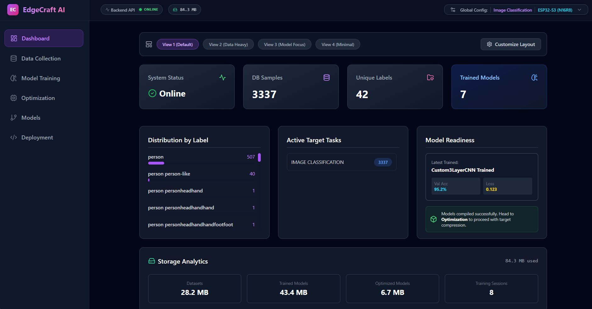
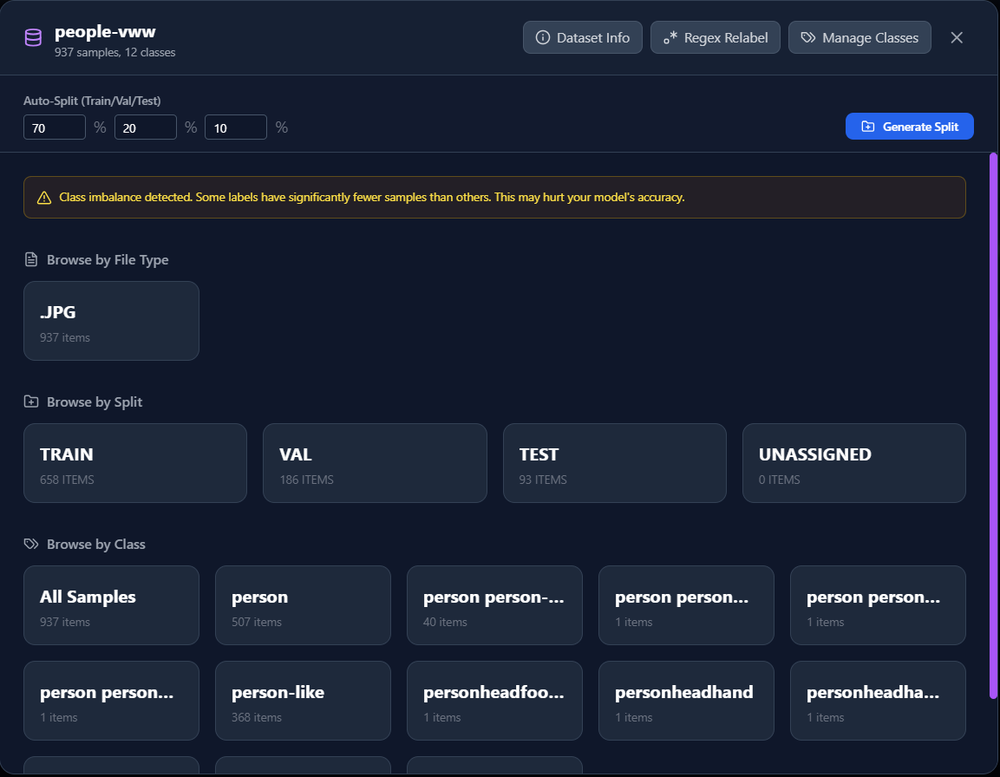
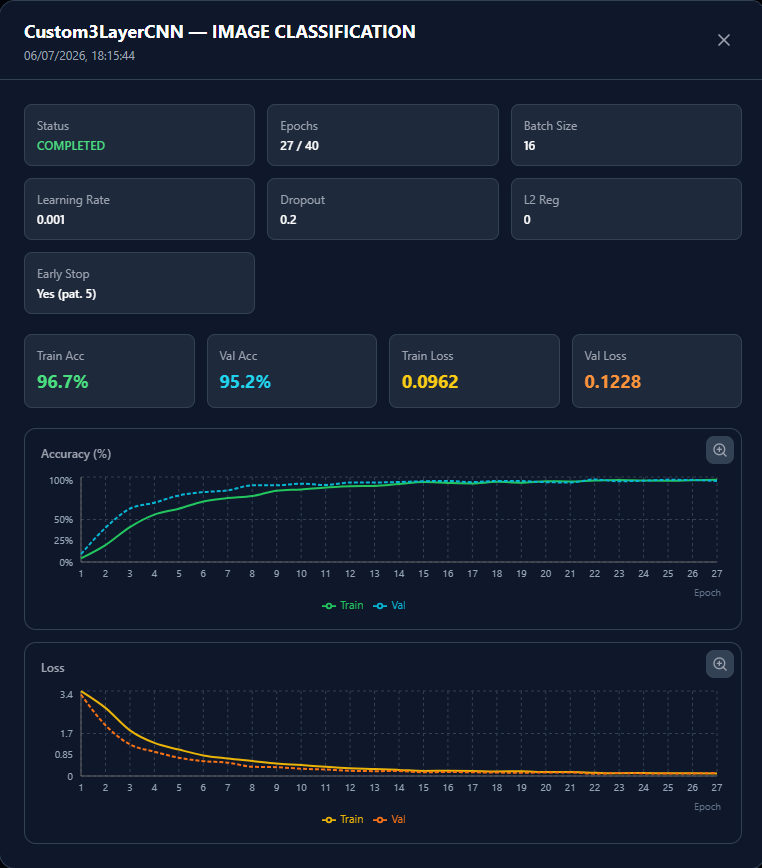
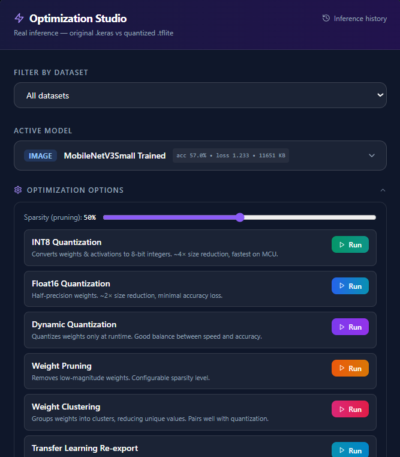
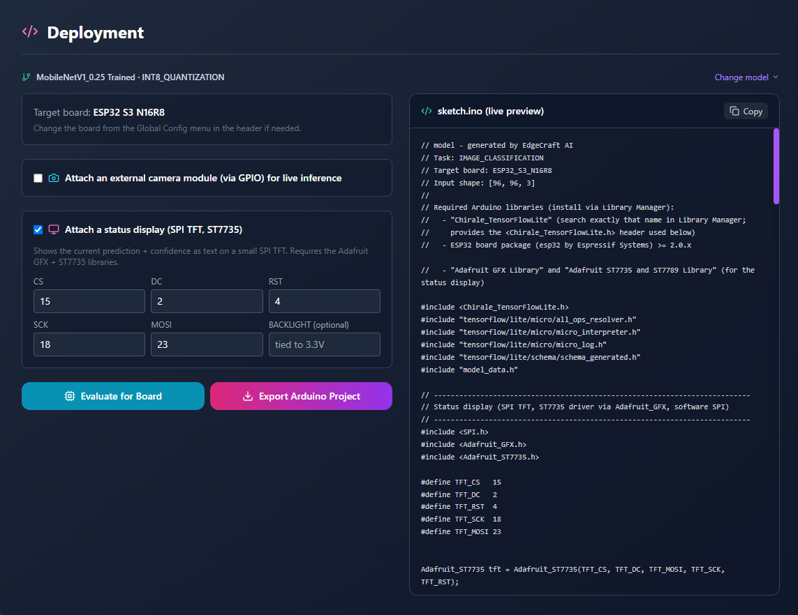

# EdgeCraft AI — Local TinyML Studio

A self-hosted, private alternative to Edge Impulse: collect data, train TinyML models, optimize them for microcontrollers, and export ready-to-flash Arduino/C++ projects, all on your own machine.

> **Status:** functional end-to-end (dataset → train → optimize → evaluate → export), verified with real TensorFlow runs and a `gcc` compile check of generated headers.

**🚀 Try it now:**

```bash
cd backend  && python -m venv venv && source venv/bin/activate && pip install -r requirements.txt && uvicorn app.main:app --reload --port 8000
cd frontend && npm install && npm run dev
```

Then open **http://localhost:5173**. Full details in [Getting Started](#getting-started).

**🤖 An LLM guides you through every stage:** not just a chatbot bolted on the side, but built into the actual workflow: it suggests training configs before you start (based on your dataset and target board), diagnoses what went wrong or right after training, and gives board-specific deployment advice grounded in your actual optimization results. Works with a free OpenRouter model out of the box, or fully offline via Ollama.

---

## Screenshots

<table>
  <tr>
    <td width="50%"><strong>Dashboard</strong><br/></td>
    <td width="50%"><strong>Dataset Overview</strong><br/></td>
  </tr>
  <tr>
    <td width="50%"><strong>Training History</strong><br/></td>
    <td width="50%"><strong>Optimization Studio</strong><br/></td>
  </tr>
  <tr>
    <td width="50%"><strong>Deployment</strong><br/></td>
    <td width="50%"></td>
  </tr>
</table>

---

## Key Features

**Data:** upload samples or bulk-import a labeled ZIP (with visual folder→label mapping and regex relabeling), manage classes/splits, live storage overview.

**Training:** TensorFlow training with live epoch metrics, CPU/GPU/auto device selection, transfer learning with freeze/fine-tune, automatic grayscale→RGB channel adaptation, LLM-suggested configs, archive/cancel/resume, and a live WebSocket job console (full tracebacks on failure).

**Optimization:** INT8, Float16, Dynamic Range, Pruning, and Weight Clustering. Real original-vs-optimized test-set comparison with a per-sample prediction gallery. Dataset → Model → Optimized Variant lineage tree.

**Deployment:** full Arduino project export (`model_data.h`, `sketch.ino`, README) for **ESP32-S3** and **ESP32-CAM**, with live-camera support, optional SPI display with live preview + confidence overlay, full Serial diagnostics, and a live "ready to flash" sketch preview. Uses **[Chirale_TensorFlowLite](https://github.com/hpssjellis/Chirale_TensorFlowLite)**.

**LLM Integration:** OpenRouter and Ollama providers.

---

## Tech Stack

- **Backend:** Python 3.10+, FastAPI, TensorFlow 2.15+/TFLite, OpenCV, Librosa, WebSockets
- **Frontend:** React 18+, Vite, TypeScript, Tailwind CSS, Recharts
- **DevOps:** Docker + Docker Compose, NGINX

---

## Getting Started

```bash
# Backend
cd backend
python -m venv venv && source venv/bin/activate   # Windows: venv\Scripts\activate
pip install -r requirements.txt
uvicorn app.main:app --reload --port 8000

# Frontend
cd frontend
npm install
npm run dev
```

| Service     | URL                        |
| ----------- | -------------------------- |
| Frontend    | http://localhost:5173      |
| Backend API | http://localhost:8000      |
| Swagger UI  | http://localhost:8000/docs |

**Docker:** `docker-compose up` → frontend on `http://localhost`, backend on `http://localhost:8000`.

**Optional local LLM:** `ollama pull neural-chat`, then enable via `.env` (`OLLAMA_ENABLED=true`) or pick Ollama in the UI. OpenRouter free-tier models are selectable directly, no install needed.

---

## Supported Tasks, Models & Boards

**Tasks:** Image Classification, Object Detection, Visual Wake Words, Keyword Spotting, Audio Classification

**Models:** MobileNetV2/V3Small/V1_0.25, EfficientNet, ResNet50V2, Custom3LayerCNN (image) · MFCC_CNN, WaveNet, AudioLSTM, AudioGRU (audio) · TinyBERT (text). Each is tagged with edge-suitability so the LLM advisor steers you away from oversized backbones on MCU targets.

| Board                  | RAM        | Flash | Export Support                    |
| ---------------------- | ---------- | ----- | --------------------------------- |
| ESP32-S3 (N16R8)       | 8 MB PSRAM | 16 MB | ✅ Full, optional external camera |
| ESP32-CAM (AI-Thinker) | ~PSRAM     | ~4 MB | ✅ Full, integrated camera        |
| Raspberry Pi Pico 2 W  | 520 KB     | 4 MB  | ⚠️ Generic Serial harness only    |
| Arduino Nano 33 BLE    | 256 KB     | 1 MB  | ⚠️ Generic Serial harness only    |

---

## Workflow

1. **Data Collection** — pick a task, upload/import samples, manage classes and splits.
2. **Model Training** — choose or get an LLM-suggested config, train with live metrics/logs.
3. **Optimization** — quantize/prune, review real accuracy/latency/size deltas.
4. **Models** — browse the dataset → model → variant tree.
5. **Deployment** — configure camera/display pins (or a preset), preview the sketch, export.

---

## API Reference (high level)

```
GET  /api/health · /api/info · /api/storage/overview · /api/models/tree

/api/datasets/*          upload, ZIP import, labeling, splits, export
/api/remote_datasets/*   browse/import external datasets
/api/training/*          start, status, metrics, cancel, archive, recommend
/api/optimization/*      quantize, status, result, export, evaluate-board, llm-suggest/optimize
/api/inference/*         run, history
WS /ws/logs/{job_id}     live job console
```

Full interactive docs at `http://localhost:8000/docs`.

---

## Known Limitations

- `TRANSFER_LEARNING` downloads ImageNet weights on first use (needs outbound access to `storage.googleapis.com`); no code changes needed on a normal connection.
- Full Arduino export only covers ESP32-S3/ESP32-CAM; Pico/Nano get a generic Serial harness.
- Board RAM/latency figures mix real measurements with clearly-labeled heuristics — treat as ballpark until validated on hardware.

---

<!-- ## TODO / Roadmap

**Near-term**

- [ ] Full camera/sensor export for Pico 2 W and Nano 33 BLE
- [ ] On-device validation of exported projects (replace heuristic estimates with measured ones)
- [ ] Offline/vendored ImageNet weights option
- [ ] Frontend test coverage

**Medium-term**

- [ ] Model Hub of curated pre-trained starting points
- [ ] Real on-device inference benchmarking
- [ ] Batch optimization (multi-model queued runs)
- [ ] Object Detection parity with other tasks
- [ ] Model versioning/rollback

**Longer-term**

- [ ] OTA model updates to deployed devices
- [ ] Edge analytics / on-device telemetry
- [ ] AutoML constrained by board memory budget
- [ ] Collaborative/federated training
- [ ] Optional opt-in encrypted cloud backup

--- -->

## License

MIT — see `LICENSE`.
