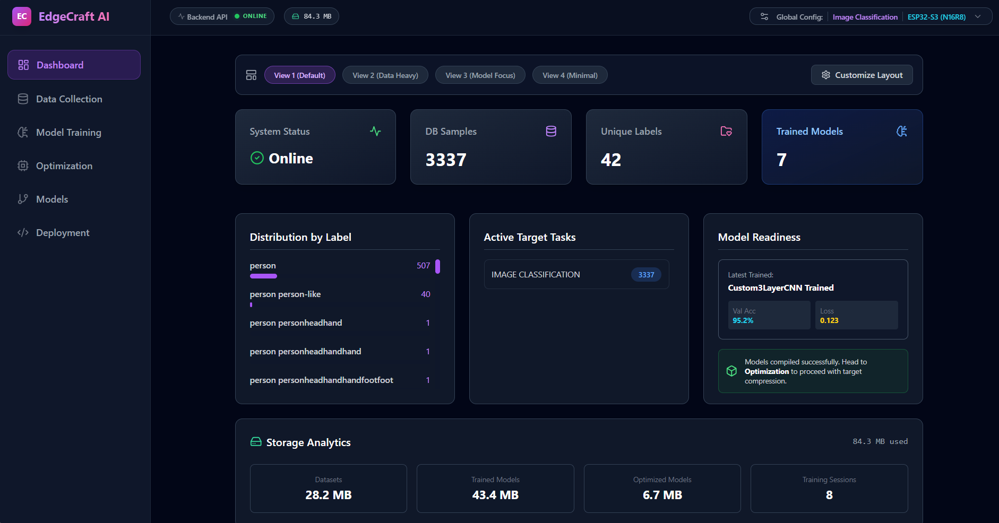
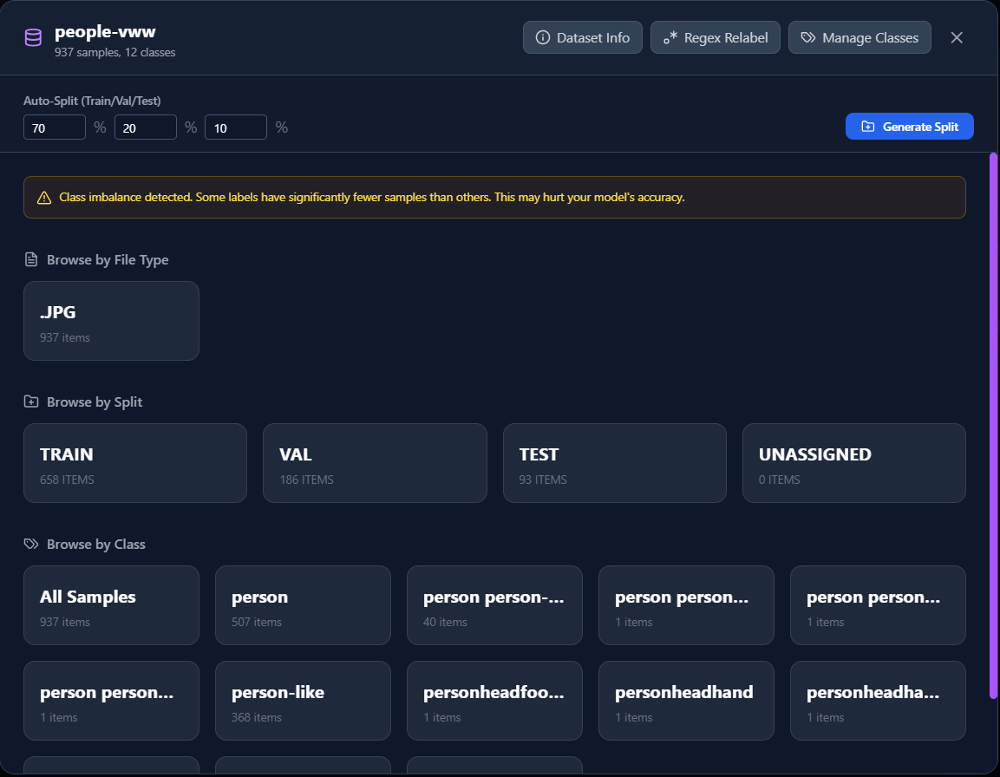
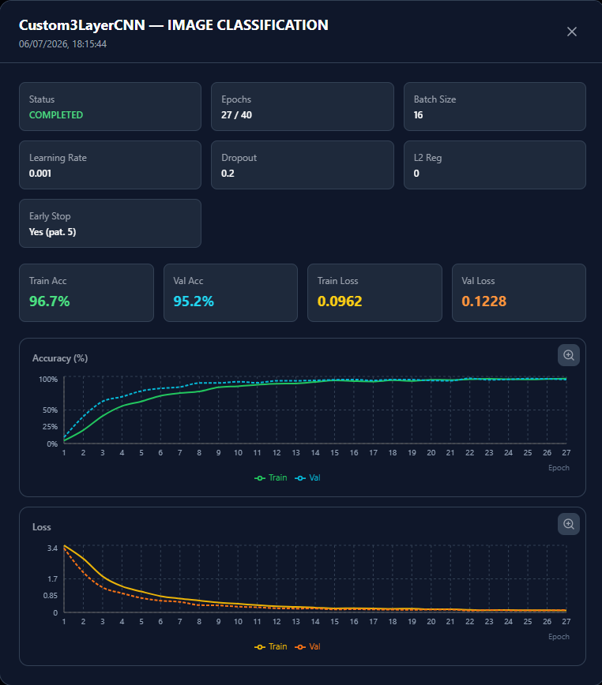
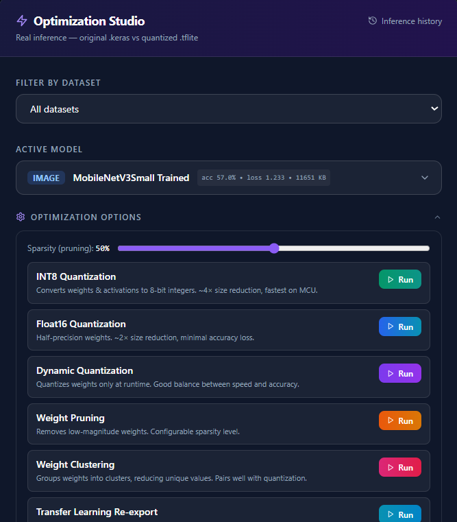
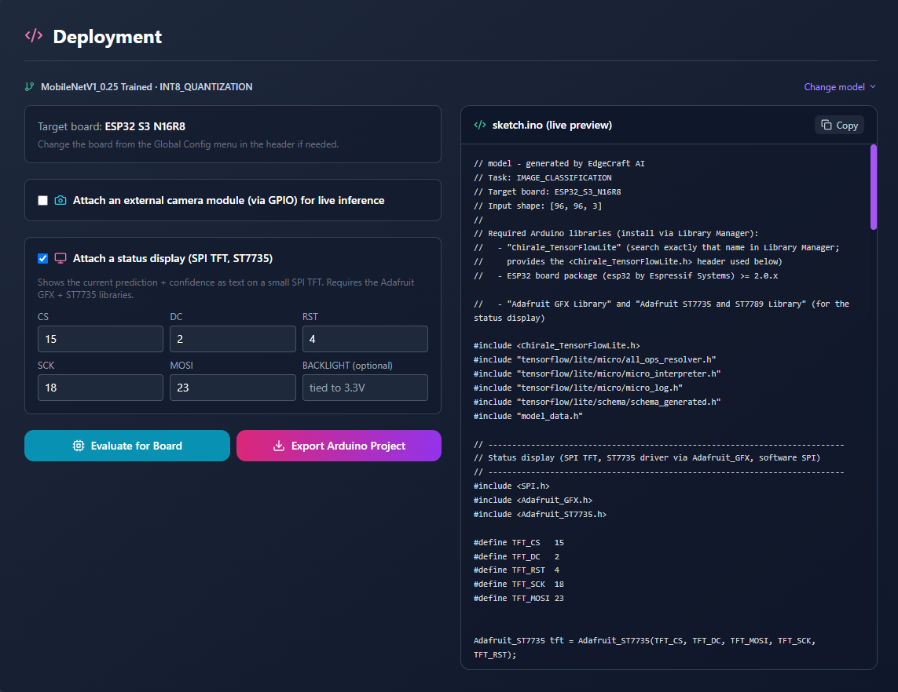

# EdgeCraft AI — Local TinyML Studio

A self-hosted, private alternative to Edge Machine Learning building: collect data, train TinyML models, optimize them for microcontrollers, and export ready-to-flash Arduino/C++ projects, all on your own machine.

> **Status:** functional end-to-end (dataset → train → optimize → evaluate → export) for classification, keyword spotting and FOMO-style detection, covered by an automated end-to-end test suite.

**🚀 Try it now:**

```bash
cd backend  && python -m venv venv && source venv/bin/activate && pip install -r requirements.txt && uvicorn app.main:app --port 8000
cd frontend && npm install && npm run dev
```

Then open **http://localhost:5173**. Full details in [Getting Started](#getting-started).

**🤖 An LLM guides you through every stage:** not just a chatbot bolted on the side, but built into the actual workflow: it suggests training configs before you start (based on your dataset and target board), diagnoses what went wrong or right after training, and gives board-specific deployment advice grounded in your actual optimization results. Works with a free OpenRouter model out of the box, or fully offline via Ollama.

---

## Screenshots

<table>
  <tr>
    <td width="50%"><strong>Dashboard</strong><br/></td>
    <td width="50%"><strong>Dataset Overview</strong><br/></td>
  </tr>
  <tr>
    <td width="50%"><strong>Training History</strong><br/></td>
    <td width="50%"><strong>Optimization Studio</strong><br/></td>
  </tr>
  <tr>
    <td width="50%"><strong>Deployment</strong><br/></td>
    <td width="50%"></td>
  </tr>
</table>

---

## Key Features

**Data:** upload samples, bulk-import a labeled ZIP (visual folder→label mapping, regex relabeling) or pull from Kaggle / Hugging Face / any URL, manage classes and splits, import YOLO / VOC / COCO / CSV bounding boxes.

**Training:** a single queue runs jobs one at a time (no GPU contention). Pretrained backbones get a frozen-backbone warm-up and then fine-tuning. You get live epoch metrics and a WebSocket console. Each finished run gets a held-out confusion matrix plus per-class precision, recall and F1. Also: LLM-suggested configs (validated, with a rule-based fallback), seeds, class balancing, and augmentation that is never baked into the exported model.

**One preprocessing path:** training, INT8 calibration, evaluation, live inference and the generated firmware share the same image and MFCC front-end (`app/services/preprocessing.py`). There is no train/serve skew.

**Optimization:** full INT8 calibrated on real samples, dynamic-range, float16, pruning with masked fine-tuning, and weight clustering. Each variant is compared against a float32 TFLite baseline: accuracy or F1, size, gzip size and latency, all measured with the same interpreter. Every variant is also checked against **TensorFlow Lite Micro**, which verifies op support and measures the exact tensor arena when the optional `tflite-micro` package is installed.

**Deployment:** an Arduino project (`model_data.h`, `sketch.ino`, README) with:
- a `MicroMutableOpResolver` holding only the model's ops
- a PSRAM-backed arena on ESP32
- ESP32-S3 / ESP32-CAM camera pipelines and an optional ST7735 display
- FOMO detection output
- for audio models, an on-device MFCC front-end (`mfcc_frontend.h`, checked against the Python one in the test suite) with I2S microphone capture or a `send_wav.py` Serial streamer

**Experiments:** compare up to four runs side by side (config diff, held-out metric, validation curves).

**LLM integration:** OpenRouter and Ollama for config suggestions, post-training review and deployment advice.

---

## Tech Stack

- **Backend:** Python 3.10-3.12, FastAPI, TensorFlow 2.17-2.20 (Keras 3) / TFLite, librosa, optional tflite-micro
- **Frontend:** React 18, Vite, TypeScript, Tailwind CSS, Recharts
- **DevOps:** Docker Compose (nginx serves the UI and proxies `/api` + `/ws`), GitHub Actions CI

---

## Getting Started

```bash
# Backend
cd backend
python -m venv venv && source venv/bin/activate   # Windows: venv\Scripts\activate
pip install -r requirements.txt                   # NVIDIA GPU: requirements-gpu.txt
pip install -r requirements-optional.txt          # optional: TensorFlow Lite Micro checks (Linux/macOS)
cp .env.example .env
uvicorn app.main:app --port 8000

# Frontend
cd frontend
npm install
npm run dev
```

| Service     | URL                        |
| ----------- | -------------------------- |
| Frontend    | http://localhost:5173      |
| Backend API | http://localhost:8000      |
| Swagger UI  | http://localhost:8000/docs |

**Docker:** `cp backend/.env.example backend/.env && docker compose up --build`, then open `http://localhost`. All data lives in `backend/data_storage` (mounted at `/data`).

**Configuration** (`backend/.env`): `EDGECRAFT_STORAGE_DIR`, `ALLOWED_ORIGINS`, `EDGECRAFT_API_TOKEN` (optional shared secret, recommended whenever the API is reachable from other machines; enter it in the app's Settings page), upload limits, LLM keys. The frontend's backend URL comes from `VITE_API_BASE_URL` or the Settings page.

---

## Supported Tasks, Models & Boards

| Task | Models | Input (default) |
| --- | --- | --- |
| Image classification / Visual wake words | MobileNetV3Small, MobileNetV1 0.25, MobileNetV2, EfficientNetB0, ResNet50V2 (pretrained) · Custom3LayerCNN | 96×96×3 / 96×96×1 |
| Object detection | FOMO_MobileNetV2 (pretrained 0.35 trunk), FOMO_Tiny: centroid grid at input/8 | 96×96×3 |
| Keyword spotting / audio classification | DS-CNN, MFCC_CNN, GRU, LSTM (unrolled) | 40 MFCC × 49 frames (1 s) / × 99 (2 s) |

Grayscale input works with every pretrained backbone. All models convert to TFLite ops supported by TensorFlow Lite Micro.

| Board                  | RAM        | Flash | Export                                                        |
| ---------------------- | ---------- | ----- | ------------------------------------------------------------- |
| ESP32-S3 (N16R8)       | 8 MB PSRAM | 16 MB | Camera or I2S mic, optional display, PSRAM arena              |
| ESP32-CAM (AI-Thinker) | 4 MB PSRAM | 4 MB  | Integrated camera or I2S mic, optional display                |
| Raspberry Pi Pico 2 W  | 520 KB     | 4 MB  | Serial harness (image values / streamed audio + on-device MFCC) |
| Arduino Nano 33 BLE    | 256 KB     | 1 MB  | Serial harness (image values / streamed audio + on-device MFCC) |

---

## Workflow

1. **Data**: pick a task, import samples, split train/val/test.
2. **Train**: choose (or let the LLM suggest) a config and watch metrics and the console. Review the held-out report.
3. **Optimize**: create variants, compare them with the float32 baseline, check the TFLite Micro badge, and try them live.
4. **Deploy**: pick a board and hardware, preview the sketch, and download the project.

Use **Models** for the dataset → model → variant tree and **Experiments** to compare runs.

---

## API Reference (high level)

```
GET  /api/health · /api/info · /api/storage/overview · /api/models/tree

/api/datasets/*          upload, chunked ZIP import, labeling, splits, export, annotations
/api/remote_datasets/*   Kaggle / Hugging Face / URL import (SSE progress)
/api/training/*          start (queued), status, cancel, archive, rename, queue, recommend
/api/optimization/*      quantize (queued), status, result, history, cancel, delete,
                         export, export-preview, evaluate-board, llm-suggest, llm-optimize
/api/inference/*         run, history
WS /ws/logs/{job_id}     live job console
```

---

## Development

```bash
cd backend && pip install -r requirements-dev.txt && ruff check app tests && pytest -q
cd frontend && npm run lint && npm run typecheck && npm test && npm run build
```

The backend suite includes end-to-end train → INT8 → export → inference runs on tiny synthetic data (about 20 s on CPU). The C port of the MFCC front-end is compiled with `g++` and compared with the Python version.

---

## Known Limitations

- Pretrained backbones download ImageNet weights on first use (needs access to `storage.googleapis.com`).
- On-device latency in the Deployment tab is a clock-scaled estimate. The generated sketch prints the real figure (`Inference: N us`).
- Without `tflite-micro` installed, the tensor arena is a liveness-analysis estimate rather than a measurement.
- FOMO reports object centroids, not bounding-box sizes.
- Models trained by earlier versions used different preprocessing and should be retrained.

---

## License

MIT — see `LICENSE`.
